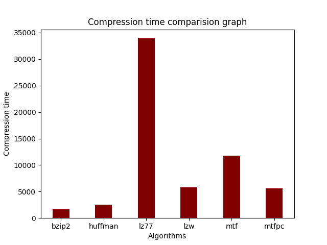
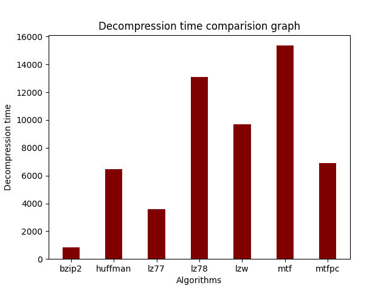

# 
Discrete Mathematics Project Report

# Benchmarking Lossless Compression Algorithms

## Abstract
This project delves into the comprehensive benchmarking of eight lossless compression algorithms, evaluating their performance based on key parameters such as compression ratio, compression speed, and decompression speed. Additionally, the project explores the adaptability of algorithms to different file formats and considers licensing and patent implications. The implementation of algorithms and the plan to transform the project into a Python tool for wider use contribute to the practical significance of this study.

## Table of Contents
1. [Introduction](#introduction)
2. [Existing Literature](#existing-literature)
3. [Topic of Study](#topic-of-study)
4. [Usage Instructions](#usage-instructions)
5. [Conclusion](#conclusion)
6. [Future Work](#future-work)
7. [Contributors](#contributors)

## Introduction
Data compression is a crucial concept in computer science and information theory, aiming to efficiently represent and transmit data. In the digital world, where data is constantly expanding, effective compression methods are essential. The main objective is to shrink the size of data files or streams while retaining the essential information.

### Motivation
Lossless compression is vital for optimizing storage and transmission efficiency, making it imperative to evaluate and compare various algorithms to identify the most effective solutions.Some of it's most important uses are:

1. **Resource Optimization:**
   - **Storage Efficiency:** Compression allows for the conservation of storage space by reducing the amount of disk or memory required to store data.

2. **Transmission Speed:**
   - **Faster Data Transfer:** Compressed data can be transmitted more quickly over networks, contributing to improved efficiency in data transfer.

3. **Multimedia Applications:**
   - **Enhanced Media Streaming:** Compression is crucial for multimedia applications, such as audio and video streaming, where large volumes of data need to be processed in real-time.

4. **Information Security:**
   - **Encrypted Compression:** Compression combined with encryption enhances data security by reducing the amount of exposed information.

### Key Performance Parameters
The theme of data compression can be classified into two major section namely: Lossless Compression and Lossy Compression where:
1. **Lossless Compression:**
   - **Preservation of Original Data:** Lossless compression techniques retain all the original data after compression and subsequent decompression. This is crucial in applications where *data integrity is paramount*, such as text documents or executable files.

2. **Lossy Compression:**
   - **Selective Data Discarding:** Lossy compression involves discarding some data during the compression process. While this results in a more significant reduction in file size, it is typically employed in applications where *minor loss of data is acceptable*, such as in image and audio compression.

The project focuses on three primary parameters: compression ratio, compression speed, and decompression speed. Additionally, the adaptability of algorithms to different file formats is considered, along with potential licensing and patent implications.
1. Compression Ratio:
    Compression ratio is typically considered the most critical parameter, as it directly reflects the efficiency of the compression algorithm in reducing the size of the data.
2. Compression Speed:
    Speed of compression is essential, especially in scenarios where data needs to be compressed quickly, such as in real-time applications or on-the-fly compression.
3. Decompression Speed:
    Decompression speed is important for efficient retrieval and use of compressed data, particularly in applications where decompression time matters.
4. Memory Usage:
    Memory usage is significant, especially in resource-constrained environments. Algorithms that use less memory are often preferred.
5. Adaptability to Data Types:
    The ability of the algorithm to handle different types of data is crucial, as it ensures versatility and usefulness across a range of applications.
6. License and Patent Considerations:
    While important, licensing and patent considerations may have less immediate impact on algorithm selection compared to technical performance parameters.

Even though there are many more parameters to compare the algorithm by. Our main focus would be on there 5 parameters throughout this project. 
Apart from that we'll be **focussing our efforts solely on lossless compression algorithms** in this report.

## Existing Literature
At first, people used basic methods like Run-Length Encoding (RLE) and Huffman coding for data compression. Then, more advanced techniques like Lempel-Ziv-Welch (LZW) and Burrows-Wheeler Transform (BWT) came along, and they became part of standards like GIF and ZIP.

Studies have compared these methods, looking at things like how much they shrink data, how fast they work, and how well they handle different types of data. Legal issues, like patents and licenses, also play a role in deciding which compression methods get used.

Recently, there are new algorithms like Brotli and Zstandard that work in real-time, which is useful for fast-changing situations. Researchers are also figuring out how to use compression in new technologies, shaping the direction of future research.

There are 4 main models for lossless compression algorithms. Namely:
#### 1. Dictionary-Based Models:
   - **LZ77:**
     - LZ77 is a dictionary-based algorithm that identifies and encodes repeated patterns in the data, enhancing compression efficiency by referencing earlier occurrences.

   - **LZ78:**
     - LZ78 is another variant of the Lempel-Ziv algorithm family, using a dictionary-based approach to compress data by encoding repeated sequences.

   - **LZW:**
     - Lempel-Ziv-Welch (LZW) is a dictionary-based compression algorithm that builds on the principles of LZ78. It became widely known for its use in compression standards like GIF and the Unix "compress" utility.

#### 2. Entropy Coding Models:
   - **Huffman Coding:**
     - A variable-length entropy coding technique that assigns shorter codes to more frequent symbols, optimizing the overall encoding efficiency.

   - **Arithmetic Coding:**
     - An alternative entropy coding approach where entire symbols are encoded as fractional values within a range, offering high compression ratios.

#### 3. Transform-Based Models:
   - **Move-to-Front (MTF):**
     - MTF is a transform-based model that rearranges the symbols in the data based on their frequency, potentially improving compression efficiency.

### 4. Adaptive Models:
   - **Prediction by Partial Matching (PPM):**
     - PPM is a context-based adaptive model that considers the context of symbols to make informed predictions. It adapts to changing patterns in the data.

   - **Move-to-Front with Predictive Counting (MTFPC):**
     - MTFPC combines the move-to-front technique with predictive counting, enhancing the adaptability and efficiency of the compression process.

### Benchmarking Studies
Benchmarking studies are like performance tests for compression methods. They help us figure out how well different compression techniques work by comparing them. These studies look at things like how much data gets reduced in size (compression ratio), how fast the compression and decompression processes are, and how well the methods handle different types of data. The information from these studies is valuable because it helps researchers and users choose the best compression method for their specific needs. It also encourages competition among researchers to come up with better and faster compression techniques, leading to ongoing improvements in the field.

## Topic of Study
Exploring lossless compression algorithms unveils their varied performance. Benchmarking studies act as our guide, helping us navigate and understand how well these algorithms work in different situations, ensuring we choose the right one for specific needs.

### Implemented Algorithms

1. [**Huffman:**](./src/huffman/huffman.py)
   - **Inventor:** David A. Huffman
   - **Advantage:** Huffman coding achieves efficient compression, especially for files with disparate symbol frequencies.
   - **Disadvantage:** It may not perform optimally when the symbol frequencies are very similar.
   - **Introduction:** Huffman coding optimizes data compression by assigning shorter codes to more frequent symbols.

2. [**LZ77:**](./src/lz77/lz77.py)
   - **Inventor:** Abraham Lempel and Jacob Ziv
   - **Advantage:** LZ77 excels at compressing repetitive patterns in data.
   - **Disadvantage:** It may not perform as well with highly random or unique data.
   - **Introduction:** LZ77 is a dictionary-based algorithm that identifies and encodes repeated patterns in data.

3. [**LZ78:**](./src/lz78/lz78.py)
   - **Inventor:** Abraham Lempel and Jacob Ziv
   - **Advantage:** LZ78 improves upon LZ77 by encoding repeated sequences more efficiently.
   - **Disadvantage:** It may exhibit higher complexity in certain scenarios.
   - **Introduction:** LZ78, another Lempel-Ziv variant, uses a dictionary-based approach to compress data by encoding repeated sequences.

4. [**LZW:**](./src/lzw/lzw.py)
   - **Inventor:** Terry Welch
   - **Advantage:** LZW is known for its simplicity and effectiveness, widely used in various applications.
   - **Disadvantage:** It may face challenges with patent-related issues, impacting its open usage.
   - **Introduction:** Lempel-Ziv-Welch (LZW) is a widely used dictionary-based compression algorithm known for its use in GIF and Unix "compress."

5. [**Arithmetic:**](./src/arithmetic/arithmetic.py)
   - **Inventor:** Elias Elias
   - **Advantage:** Arithmetic coding can achieve better compression ratios compared to Huffman coding.
   - **Disadvantage:** It requires more computational resources, making it slower in some cases.
   - **Introduction:** Arithmetic coding is an entropy coding technique encoding entire symbols as fractional values within a range.

6. [**MTF:**](./src/mtf)
   - **Advantage:** MTF is simple and can be effective for certain types of data with localized patterns.
   - **Disadvantage:** It may struggle with highly diverse or random data.
   - **Introduction:** Move-to-Front (MTF) is a transform-based model that rearranges symbols based on their frequency, potentially improving compression efficiency.

7. [**MTFPC:**](./src/mtfpc/mtfpc.py)
   - **Advantage:** MTFPC combines MTF with predictive counting, enhancing adaptability to changing patterns.
   - **Disadvantage:** It may have increased complexity compared to basic MTF.
   - **Introduction:** Move-to-Front with Predictive Counting (MTFPC) combines move-to-front with predictive counting for enhanced compression adaptability.

8. [**BZIP2:**](./src/bzip2)
   - **Inventor:** Julian Seward
   - **Advantage:** BZIP2 combines BWT and Huffman coding, offering a good balance between compression ratio and speed.
   - **Disadvantage:** It may require more memory compared to some other algorithms.
   - **Introduction:** BZIP2 is a data compression algorithm that combines the Burrows-Wheeler Transform with Huffman coding.

9. [**PPM:**](./src/ppm)
   - **Inventor:** Jorma Rissanen
   - **Advantage:** PPM is adaptive, making it effective for a wide range of data types.
   - **Disadvantage:** It may be computationally intensive and can have slower compression speeds.
   - **Introduction:** Prediction by Partial Matching (PPM) is a context-based adaptive model that considers symbol context for informed predictions in data compression.

### Benchmarking Methodology
Our benchmarking methodology though rudimentry includes a stadnardised dataset and well as a variety of parameters to jusdge all these algorithms by. For each algorithm we use the most efficient codes to compress the files and then to decompress them. We have used a standardised procedure for each algorithm.

### Challenges and Solutions
Some of the challenges we faced while making of this project including the lack of knowledge and mathematical experience in the field as most of the data compression algorithms studies and and most of the higher level algorithms expected us to have a good amount of mathematical prowess in probabilistic models, information theory, entropy and markov chains. However we were successful in implementing most of the algorithms on our own.
Some of the advanced algorithms were taken from implementations done by the open source community along with the due credit given to them in the acknowledgments.

### Future Vision
In future we plan on copleting this project by impleting atleast 15 algorithms and making this project moduler as well as converting it into a python tool which can be used to compare the performance of all these 15 algorithms on any data set as per the liking of the user.

### Observations

<small>We have removed LZ78 and PPM from Compression time comparision Graph due to their exponentially high time consumption. Also We have removed PPM from Decompression time comparision Graph due to its exponentially high time consumption.</small>

### Methodology Improvements
1. Diverse Data Set
2. More Efficient Implementations
3. Increase in the Number of Parameters

Would help us in improving the methodology

## Contributors
### Acknowledgements
1. Introduction to Data Compression by Khalid Sayood
2. Lossless Compression Handbook by Khalid Sayood
3. [Data Compression Applets Library](https://www.stringology.org/DataCompression/content.html)
4. [project by Ellen Chang, Udara Fernando, and Jane Hu for the Sophomore College seminar "The Intellectua Excitement of Computer Science."](https://cs.stanford.edu/people/eroberts/courses/soco/projects/data-compression/overview/siteinfo/index.htm)
5. [Lossless Compression Wiki](https://en.wikipedia.org/wiki/Lossless_compression)

### Team Members
- Kushagra Gupta: Algorithms and Modularity
- Somay Jalan: Algorithms and Ananlysis
- Mudit Bansal: Analysis and Dataset Creation

---

